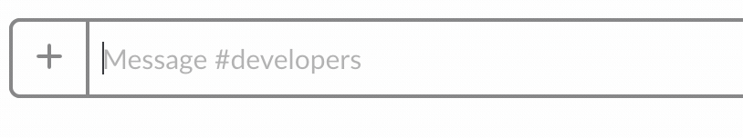

# slacktyping

> Make slack show that you're typing when others start typing.

#### A harmless but little annoying module.

If someone starts typing in a slack channel that you're in, this module will make it say you're typing.



## Usage

Create a .env file that contains your [user token](https://api.slack.com/custom-integrations/legacy-tokens)
- Optionally, add a delay to make your "typing" begin a bit later and seem more "human."

It should like like this:

#### .env
```
token=xoxp-123456....
delay=1300
```

Then install the module via git or npm, directions below.


## Install

### git
With git, run

```
$ git clone https://github.com/jekrb/slacktyping.git
$ cd slacktyping
... edit .env to add token and optional delay...
$ npm install
$ npm start
```

### npm
With [npm](https://npmjs.org/) installed, run

```
$ npm install slacktyping -g
```

Use `slacktyping` in directory with a `.env` file that contains your token and optional delay.

## Acknowledgments

slacktyping was inspired by the ruby program [`will/slacktyping`](https://github.com/will/slacktyping)

## License

MIT

